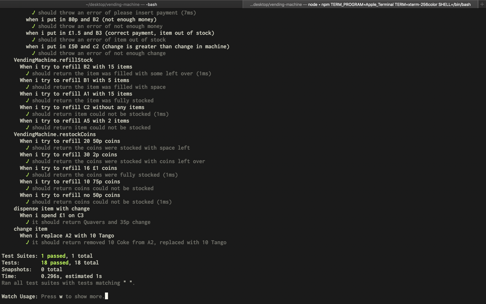

# Interview Practice - Vending Machine

The aim of this project was to practice as example interview task, in this case it was to program the back end of a vending machine in node.js using TDD (test driven development).

## Technologies Used

- Node.js
- Jest

## Installation

To install jest, shell into your project root directory and run:

`npm install jest --global`

To run the tests use:

`jest __tests__/vending-machine.spec.js`

Alternatively run:
`jest-watch`

Now jest will run everytime it detects a code change.

## Image of tests passed

